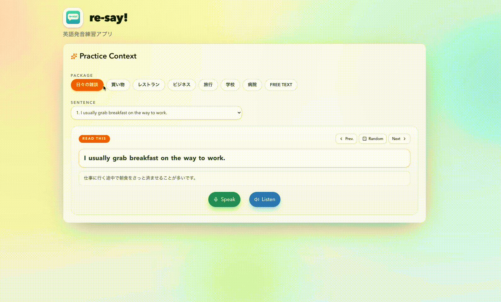

# re-say! ― English Pronunciation Practice App

Azure Speech Service を使った英語発音練習アプリ
Google アカウントでログインし、ブラウザ上で録音した音声を発音評価 API に送り、文全体と単語・音素単位のフィードバックを確認できます。
日常英会話の暗記用フラッシュカードも備えており、質問/回答ペアをめくりながら確認し、回答文の TTS 読み上げを発音 reference として聞けます。

## What is this?

(エレベーターピッチ)

- `安価で英語の発音練習` がしたい
- `英語学習者` 向けの、
- `re-say!` というアプリは、
- `AIによる英語発音評価アプリ` である。
- これは `英文を音読することで発音の自動評価` ができ、
- `既存の英語学習アプリ` とは違って、
- `サブスクリプション費や受講料がほぼ無料で、ユーザが練習したい任意英文の発音評価、音素単位での発音評価、日常英会話フレーズの暗記機能` が備わっている。

## Features

- 発音練習
  - 録音した英文音読を Azure Speech Service で評価
  - 文全体、単語、音素単位のフィードバックを表示
  - お手本音声と自己録音の再生に対応
- フラッシュカード
  - `/flash_cards` で日常英会話の質問/回答ペアを暗記
  - クリックまたはタップでカードの表裏を反転
  - Prev/Next ボタンと左右スワイプ/ドラッグでカード移動
  - 複数トピックの選択に対応
  - 英文の下に日本語訳を補助表示
  - Speak ボタンで回答文を TTS 読み上げ
- 認証
  - Firebase Authentication の Google Sign-In によるログイン必須化

## Current Architecture

- `frontend`: Vite + React + Firebase Hosting
- `backend`: Express + TypeScript + Cloud Run
- `auth`: Firebase Authentication (Google Sign-In)
- `speech api`: Azure Speech Service
- `learning content`: static JSON bundled with frontend

## Demo



## Tech Stack

- Frontend
  - React
  - TypeScript
  - Vite
  - Tailwind CSS
  - shadcn/ui
  - Firebase Web SDK
- Backend
  - Express
  - TypeScript
  - Firebase Admin SDK
- Infrastructure
  - Firebase Hosting
  - Firebase Authentication
  - Google Cloud Run
  - Google Secret Manager
  - Azure Speech Service

## Repository Structure

```text
re-say/
├── apps/
│   ├── frontend/
│   │   ├── src/
│   │   └── package.json
│   └── backend/
│       ├── src/
│       ├── Dockerfile
│       └── package.json
├── docs/
│   ├── knowledge/
│   └── specs/
├── packages/
│   └── shared/
└── package.json
```

## Prerequisites

- Node.js 18+
- npm
- Azure Speech Service subscription
- Firebase project
- Google Cloud project

## Local Development

### 1. Install dependencies

```bash
npm install
cd apps/frontend && npm install
cd ../backend && npm install
cd ../..
```

### 2. Configure frontend env

Create `apps/frontend/.env.local`.

```dotenv
VITE_FIREBASE_API_KEY=...
VITE_FIREBASE_AUTH_DOMAIN=your-project-id.firebaseapp.com
VITE_FIREBASE_PROJECT_ID=your-project-id
VITE_FIREBASE_STORAGE_BUCKET=your-project-id.firebasestorage.app
VITE_FIREBASE_MESSAGING_SENDER_ID=...
VITE_FIREBASE_APP_ID=...
VITE_API_BASE_URL=http://localhost:3000
```

### 3. Configure backend env

Create `apps/backend/.env`.

```dotenv
AZURE_SPEECH_KEY=...
AZURE_SPEECH_REGION=japaneast
FIREBASE_PROJECT_ID=your-firebase-project-id
CORS_ALLOWED_ORIGINS=http://localhost:5173
SKIP_AUTH_IN_DEV=true
```

補足:

- `SKIP_AUTH_IN_DEV=true` を付けると、ローカル開発時だけbackendのFirebase token検証をスキップ可能

### 4. Run the app

```bash
npm run dev
```

起動先:

- frontend: `http://localhost:5173`
- backend: `http://localhost:3000`

## Security Model

- Google Sign-In 必須
- frontend は Firebase ID token を `Authorization: Bearer ...` で backend に送信
- backend は Firebase Admin SDK で token を検証
- backend は CORS allowlist で frontend origin を制限
- `AZURE_SPEECH_KEY` は Secret Manager 経由で管理

## Main Scripts

ルート:

```bash
npm run dev
npm run build
npm run format
```

frontend:

```bash
cd apps/frontend
npm run dev
npm run build
```

backend:

```bash
cd apps/backend
npm run dev
npm run build
npm run start
```
